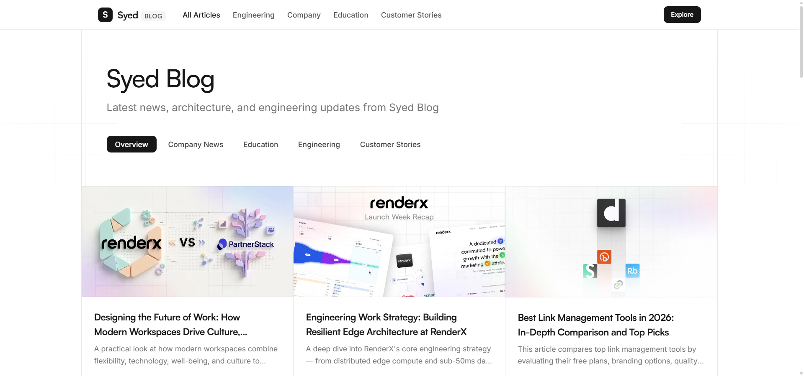

<div align="center">

# 🌐 Syed Tech Blog / সাঈদ ব্লগ

**A modern, blazing-fast multilingual engineering insights and tech publication platform.**

[](https://syed-tech-blog.vercel.app/blog)
[](https://nextjs.org/)
[](https://react.dev/)
[](https://www.typescriptlang.org/)
[](https://tailwindcss.com/)
[](#-internationalization--edge-geolocation)
[](#-automated-two-way-ai-translation)
[](LICENSE)

<br />

[Explore Live Demo](https://syed-tech-blog.vercel.app/blog) · [Report Bug](https://github.com) · [Request Feature](https://github.com)

<br />



</div>

---

## 📖 Overview

**Syed Tech Blog (সাঈদ ব্লগ)** is an open-source, high-performance publishing platform crafted with **Next.js 16 (App Router)**, **React 19**, and **Tailwind CSS**. Designed with a clean aesthetic inspired by industry-leading developer portals (such as Dub and Vercel), it features **Edge-level Geolocation Routing**, **Two-Way AI Auto-Translation**, and native typography support for both **English** and **Bengali (বাংলা)**.

---

## ✨ Features

- ⚡ **Next.js 16 App Router & React 19**: Built on React Server Components (RSC) for minimal client-side JavaScript, instant page loads, and static site generation (SSG).
- 🌍 **Edge Geolocation & Subpath i18n (`/en`, `/bn`)**:
  - Automatically routes visitors from Bangladesh (`BD`) to Bengali (`/bn/blog`) and visitors from the US/global to English (`/en/blog`).
  - Zero-latency Edge Middleware detection via Vercel (`x-vercel-ip-country`, `request.geo`) and Cloudflare (`cf-ipcountry`) headers.
  - Manual language switcher with cookie persistence (`NEXT_LOCALE`), inspired by Dub.co.
  - Full SEO support with localized metadata, alternate hreflang tags, and canonical links.
- 🤖 **Automated Two-Way AI Translation (GitHub Action & Local CLI)**:
  - Write an article in either English (`content/blog/en/`) or Bengali (`content/blog/bn/`) and commit.
  - GitHub Actions automatically translates the missing counterpart using the **Google Gemini API** (`gemini-2.5-flash`).
  - Preserves frontmatter, code blocks, math formulas, and skips already translated posts.
- 🔤 **Bilingual Typography & Bengali Optimization**:
  - Dedicated Google Font **Hind Siliguri** loaded specifically for Bengali text with clean kerning and line heights.
  - English typography powered by Vercel **Geist** / **Inter**.
- 📝 **Full MDX Pipeline**: Write content seamlessly using Markdown with JSX components, powered by `next-mdx-remote`, `gray-matter`, and `remark-gfm`.
- 📑 **Interactive Reading Experience**:
  - Auto-generated sticky Table of Contents ("On this page" / "এই পৃষ্ঠায়") tracking active reading sections.
  - Multi-author support with avatars, bios, and titles.
  - Reading time calculation and formatted publication dates in both locales.
- 🏷️ **Dynamic Category Filtering**:
  - Filter posts across **Engineering**, **Company News**, **Education**, and **Customer Stories** with full Bengali translations.
- 📱 **100% Mobile Responsive**: Carefully adapted for mobile devices, tablets, and ultrawide desktop monitors with custom responsive navigation.
- 🔍 **SEO & Social Sharing Ready**:
  - Localized Open Graph (OG) image generation and Twitter Cards.
  - Multi-language dynamic `sitemap.xml` and `robots.txt`.

---

## 🛠️ Tech Stack

| Technology | Purpose |
| :--- | :--- |
| **[Next.js 16](https://nextjs.org/)** | Full-stack framework with App Router, Edge Middleware, and Server Components |
| **[React 19](https://react.dev/)** | Modern component library & rendering engine |
| **[TypeScript](https://www.typescriptlang.org/)** | Strict type safety across schemas, dictionaries, and components |
| **[Tailwind CSS v4](https://tailwindcss.com/)** | Utility-first styling with `@tailwindcss/typography` |
| **[Google Gemini API](https://ai.google.dev/)** | AI-driven Markdown/MDX translation preserving frontmatter and code blocks |
| **[Google Fonts](https://fonts.google.com/)** | **Hind Siliguri** (Bengali) & **Inter / Geist** (English) |
| **[Motion](https://motion.dev/)** | Fluid animations and UI interactions |
| **[MDX / Remark](https://mdxjs.com/)** | Content authoring with MDX parsing and GitHub Flavored Markdown |
| **[Lucide React](https://lucide.dev/)** | Modern icon set |
| **[Vercel](https://vercel.com/)** | Global Edge hosting and geolocation routing |

---

## 📁 Project Structure

```bash
syed-tech-blog/
├── .github/
│   └── workflows/
│       └── auto-translate.yml  # GitHub Action for automated 2-way AI translation
├── content/
│   └── blog/
│       ├── en/                 # English MDX articles
│       │   ├── engineering-work-strategy.mdx
│       │   └── 301-vs-302-redirect.mdx
│       └── bn/                 # Bengali MDX articles (Hind Siliguri font)
│           ├── engineering-work-strategy.mdx
│           └── 301-vs-302-redirect.mdx
├── public/
│   ├── images/                 # Post cover photos and assets
│   └── screenshots/            # Screenshots for documentation
├── scripts/
│   └── auto-translate.mjs      # Gemini AI two-way translation CLI script
├── src/
│   ├── app/                    # Next.js 16 App Router
│   │   ├── [locale]/           # Dynamic localized routing (/en, /bn)
│   │   │   ├── (home)/         # Localized home page
│   │   │   ├── blog/
│   │   │   │   ├── [slug]/     # Individual localized blog post
│   │   │   │   ├── category/   # Localized category filter
│   │   │   │   └── page.tsx    # Localized blog listing
│   │   │   └── opengraph-image.tsx # Localized OG image
│   │   ├── layout.tsx          # Root layout with font injection & LocaleProvider
│   │   ├── sitemap.ts          # Multilingual sitemap generator
│   │   └── robots.ts           # Robots.txt generator
│   ├── components/
│   │   ├── blog/               # Blog cards, header, grid, CTA, TOC
│   │   └── layout/             # Nav, Footer, LanguageSwitcher (Dub-style)
│   ├── config/
│   │   ├── i18n.ts             # Supported locales (en, bn), cookies, path helpers
│   │   ├── blog-categories.ts  # Category slugs and definitions
│   │   └── site.ts             # Site metadata and author info
│   ├── dictionaries/           # JSON UI strings for each language
│   │   ├── en.json
│   │   └── bn.json
│   ├── lib/
│   │   ├── blog.ts             # Locale-aware MDX loader and fallback resolver
│   │   └── dictionary.ts       # Type-safe dictionary reader
│   └── styles/
│       ├── fonts.ts            # Hind_Siliguri & Inter font configurations
│       └── globals.css         # Tailwind v4 theme & Bengali font rules
├── package.json
└── tsconfig.json
```

---

## 🌍 Internationalization & Edge Geolocation

The blog uses an industry-standard architecture for internationalization (similar to Stripe, Dub, and Vercel):

### 1. Edge Geolocation Detection (`src/middleware.ts`)
When a user visits the root `/` or `/blog`, Next.js Edge Middleware inspects:
1. **User Cookie (`NEXT_LOCALE`)**: If the user has previously toggled the language, their choice always takes precedence.
2. **Geo IP Headers**: Checks `request.geo?.country`, `x-vercel-ip-country`, and `cf-ipcountry`:
   - `BD` (Bangladesh) $\rightarrow$ Redirects to `/bn` (Bengali).
   - All other regions (US, UK, etc.) $\rightarrow$ Defaults to `/en` (English).
3. **Accept-Language**: Falls back to the browser's language header if Geo IP is absent (e.g. localhost).

### 2. Language Switcher
Users can switch between **🇺🇸 English** and **🇧🇩 বাংলা** at any time using the navigation switcher. Switching updates the `NEXT_LOCALE` cookie (persisted for 1 year) and redirects to the equivalent localized path without losing context.

### 3. Bengali Typography (`Hind Siliguri`)
Bengali script requires specific kerning and line-heights. We integrate Google's **Hind Siliguri** font in `src/styles/fonts.ts` and apply `font-bangla` to `<body>` whenever `lang="bn"`, ensuring crisp, legible Bengali rendering across all devices.

---

## 🤖 Automated Two-Way AI Translation

Never manually translate MDX articles again. The blog includes a zero-friction translation pipeline powered by Google Gemini AI.

### How It Works:
```
[ Write in English ] ───> Push to content/blog/en/ ───> GitHub Action / Local Script
                                                               │
                                                               ▼
                                               Gemini 2.5 Flash API translates
                                               (Preserves frontmatter & code)
                                                               │
                                                               ▼
[ Auto-generated ]   <─── Commit back to repo  <─── Creates content/blog/bn/
```

- **Two-Way Sync**: Write in English $\rightarrow$ auto-generates Bengali. Write in Bengali $\rightarrow$ auto-generates English.
- **Incremental & Smart**: If the translated file already exists, it is **skipped** to avoid unnecessary API costs or overwriting manual edits.
- **Code & Markdown Preservation**: Only human-readable titles, summaries, and paragraphs are translated; frontmatter structure, images, slugs, URLs, and code blocks (` ```tsx `, etc.) remain 100% untouched.

### Running Translation Locally:
1. Add your Google Gemini API key to `.env.local`:
   ```bash
   GEMINI_API_KEY=your_gemini_api_key_here
   ```
2. Run the translation command:
   ```bash
   pnpm translate
   # or
   npm run translate
   ```

### GitHub Actions Setup:
The translation workflow runs automatically on every `git push` that touches `content/blog/**`.

To enable this on GitHub:
1. Go to your GitHub repository $\rightarrow$ **Settings** $\rightarrow$ **Secrets and variables** $\rightarrow$ **Actions**.
2. Click **New repository secret**.
3. Name: `GEMINI_API_KEY`
4. Value: Your Google Gemini API Key (obtain free from [Google AI Studio](https://aistudio.google.com/)).
5. Under **Settings** $\rightarrow$ **Actions** $\rightarrow$ **General** $\rightarrow$ **Workflow permissions**, ensure **"Read and write permissions"** is selected so the action can commit translated articles back to the repository.

---

## ✍️ Adding a New Blog Post

All articles are stored as `.mdx` files under `content/blog/{locale}/`.

To write a post:
1. Create `content/blog/en/my-new-post.mdx` (or `content/blog/bn/my-new-post.mdx`).
2. Add your frontmatter:
   ```mdx
   ---
   slug: "my-new-post"
   title: "Understanding Distributed Systems at Scale"
   summary: "An architectural guide to designing fault-tolerant distributed systems in the cloud."
   image: "/images/blog/my-post-cover.jpg"
   dateIso: "2026-09-20T00:00:00.000Z"
   dateFormatted: "September 20, 2026"
   category: "engineering"
   categoryName: "Engineering"
   authors:
     - name: "Abu Shaid"
       image: "https://assets.dub.co/author/steventey.jpg"
       title: "Engineering & Architecture"
   ---

   Write your article content here using standard Markdown and custom components!
   ```
3. Commit and push:
   ```bash
   git add content/blog/
   git commit -m "feat(blog): add my-new-post"
   git push
   ```
4. GitHub Actions will automatically detect the new post, translate it into the opposite language folder, and commit it!

---

## 🚀 Getting Started

Follow these steps to run the project locally on your machine.

### Prerequisites

- **Node.js** 18.18+ or 20+
- **pnpm** (recommended), `npm`, or `yarn`

### Installation

1. **Clone the repository:**
   ```bash
   git clone https://github.com/abushaidislam/syed-tech-blog.git
   cd syed-tech-blog
   ```

2. **Install dependencies:**
   ```bash
   pnpm install
   # or
   npm install
   ```

3. **Configure Environment Variables (Optional):**
   Create a `.env.local` file in the root directory:
   ```bash
   # Required only for local AI translation
   GEMINI_API_KEY=your_gemini_api_key_here
   ```

4. **Start the local development server:**
   ```bash
   pnpm dev
   # or
   npm run dev
   ```

5. **Open in browser:**
   Navigate to [http://localhost:3000](http://localhost:3000) (will automatically redirect to `/en` or `/bn` based on your system locale).

---

## ⚙️ Configuration & Customization

- **Site Metadata & Author**: Update `src/config/site.ts` to customize site title, description, domain URL, and social media handles.
- **UI Translations**: Edit `src/dictionaries/en.json` and `src/dictionaries/bn.json` to modify navigation labels, category display names, or footer text.
- **Supported Locales**: Modify `src/config/i18n.ts` if you want to add more languages in the future.
- **Blog Categories**: Customize or add categories in `src/config/blog-categories.ts`.

---

## 🚢 Deployment

The easiest way to deploy this blog is using [Vercel](https://vercel.com):

1. Push your repository to GitHub.
2. Import the project into **Vercel**.
3. Set your environment variables (e.g., `NEXT_PUBLIC_SITE_URL`, `GEMINI_API_KEY` if running build-time translations).
4. Click **Deploy** — Vercel handles the build, edge geolocation headers, and global CDN caching automatically.

---

## 🤝 Contributing

Contributions, issues, and feature requests are welcome! Feel free to check the [issues page](https://github.com/abushaidislam/syed-tech-blog/issues).

---

## 📄 License

This project is licensed under the [MIT License](LICENSE).
