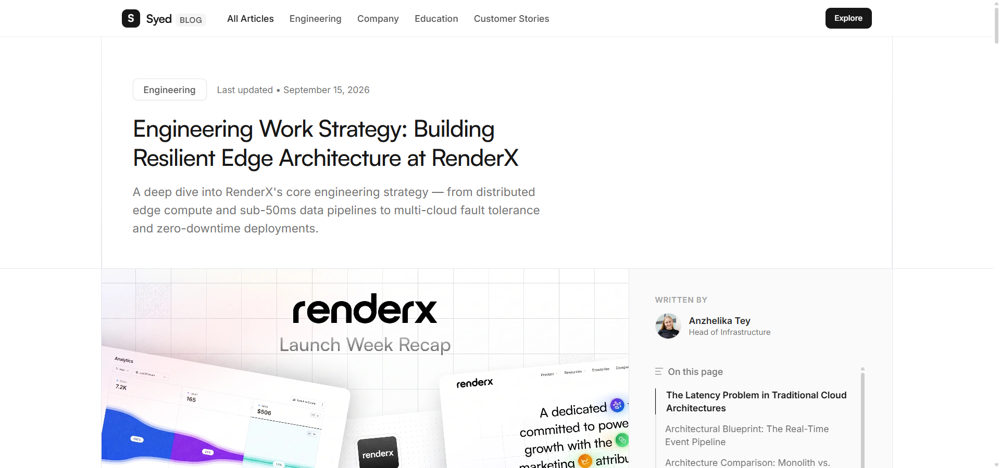
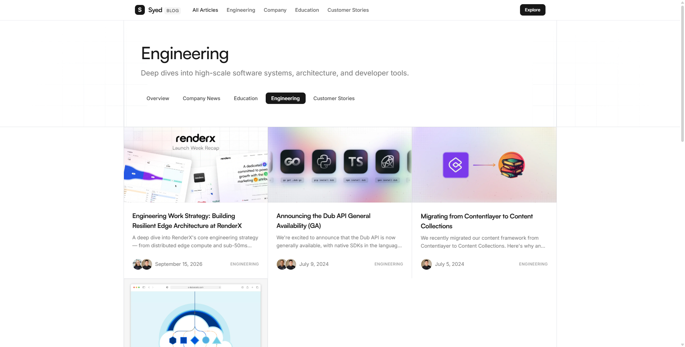
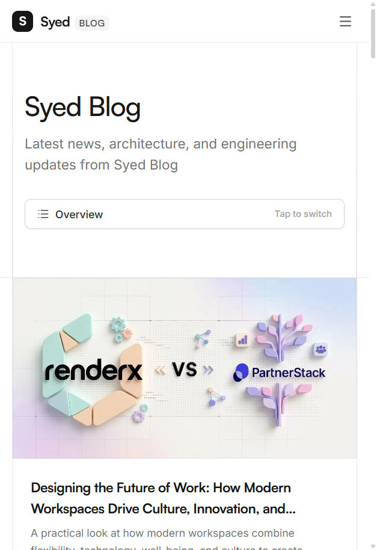

<div align="center">

# 🌐 Syed Tech Blog

**A modern, blazing-fast engineering insights and tech publication platform.**

[](https://syed-tech-blog.vercel.app/blog)
[](https://nextjs.org/)
[](https://react.dev/)
[](https://www.typescriptlang.org/)
[](https://tailwindcss.com/)
[](LICENSE)

<br />

[Explore Live Demo](https://syed-tech-blog.vercel.app/blog) · [Report Bug](https://github.com) · [Request Feature](https://github.com)

<br />


</div>

---

## 📖 Overview

**Syed Tech Blog** is an open-source, high-performance publishing platform crafted with **Next.js 16 (App Router)**, **React 19**, and **Tailwind CSS**. Designed with a clean, modern aesthetic inspired by industry-leading developer portals (like Dub and Vercel), it provides a reading and authoring experience for software engineering insights, system architecture deep dives, tutorials, and company updates.

---

## 📸 Visual Showcase

<div align="center">

### 📰 Article View with Sticky Table of Contents & Author Profiles


<br />

### 🏷️ Dynamic Category Filtering & Mobile Experience
| 📂 Category View | 📱 Responsive Mobile Layout |
| :---: | :---: |
|  |  |

</div>

---

## ✨ Features

- ⚡ **Next.js 16 App Router & React 19**: Built on the latest React Server Components (RSC) architecture for minimal client-side JavaScript and instant page transitions.
- 📝 **Full MDX Pipeline**: Write content seamlessly using Markdown with JSX components, powered by `next-mdx-remote`, `gray-matter`, and `remark-gfm`.
- 📑 **Interactive Reading Experience**:
  - Auto-generated sticky Table of Contents ("On this page") highlighting current reading section.
  - Multi-author support with avatars, bios, and titles.
  - Reading time estimation and publication dates.
- 🎨 **Minimalist & Clean UI**:
  - Modern typography using Vercel's **Geist** font family.
  - Subtle grid backgrounds and sleek borders.
  - Smooth interactive state animations powered by **Motion**.
- 🏷️ **Dynamic Category Filtering**:
  - Filter posts seamlessly across **Engineering**, **Company News**, **Education**, and **Customer Stories**.
- 📱 **100% Mobile Responsive**: Carefully adapted for mobile devices, tablets, and ultrawide desktop monitors with custom responsive navigation.
- 🔍 **SEO & Social Sharing Ready**:
  - Dynamic Open Graph (OG) and Twitter Card tags.
  - Auto-generated `sitemap.xml` and `robots.txt`.
  - Canonical URLs and structured metadata for search engines.

---

## 🛠️ Tech Stack

| Technology | Purpose |
| :--- | :--- |
| **[Next.js 16](https://nextjs.org/)** | Full-stack React framework with App Router & Server Components |
| **[React 19](https://react.dev/)** | Modern component library & rendering engine |
| **[TypeScript](https://www.typescriptlang.org/)** | Strict type safety across content schemas and components |
| **[Tailwind CSS](https://tailwindcss.com/)** | Utility-first styling with `@tailwindcss/typography` & `@tailwindcss/forms` |
| **[Motion](https://motion.dev/)** | Fluid animations and UI interactions |
| **[MDX / Remark](https://mdxjs.com/)** | Content authoring with MDX parsing and GitHub Flavored Markdown |
| **[Lucide React](https://lucide.dev/)** | Consistent, modern icon set |
| **[Vercel](https://vercel.com/)** | Global edge hosting and deployment |

---

## 📁 Project Structure

```bash
syed-tech-blog/
├── content/
│   └── blog/                   # MDX blog posts with frontmatter
│       ├── engineering-work-strategy.mdx
│       ├── best-link-management-tools.mdx
│       └── ...
├── public/
│   ├── images/                 # Post cover photos and assets
│   └── screenshots/            # Screenshots for documentation
├── src/
│   ├── app/                    # Next.js 16 App Router
│   │   ├── blog/
│   │   │   ├── [slug]/         # Individual blog post page
│   │   │   ├── category/       # Category filtered listing
│   │   │   └── page.tsx        # Blog listing page
│   │   ├── layout.tsx          # Root layout with Geist font & metadata
│   │   ├── page.tsx            # Home page redirect / overview
│   │   ├── sitemap.ts          # Dynamic sitemap generator
│   │   └── robots.ts           # Robots.txt generator
│   ├── components/
│   │   ├── blog/               # Blog cards, header, grid, CTA, TOC
│   │   └── layout/             # Navigation header, footer
│   ├── config/
│   │   ├── blog-categories.ts  # Category definitions & slugs
│   │   └── site.ts             # Site metadata, links, and author info
│   ├── lib/
│   │   └── blog.ts             # MDX parsing, reading time, and query helpers
│   └── types/                  # TypeScript interface definitions
├── package.json
├── tailwind.config.ts
└── tsconfig.json
```

---

## 🚀 Getting Started

Follow these steps to run the project locally on your machine.

### Prerequisites

- **Node.js** 18.18+ or 20+
- **pnpm** (recommended), `npm`, or `yarn`

### Installation

1. **Clone the repository:**
   ```bash
   git clone https://github.com/your-username/syed-tech-blog.git
   cd syed-tech-blog
   ```

2. **Install dependencies:**
   ```bash
   pnpm install
   # or
   npm install
   ```

3. **Start the local development server:**
   ```bash
   pnpm dev
   # or
   npm run dev
   ```

4. **Open in browser:**
   Navigate to [http://localhost:3000](http://localhost:3000) to view the blog.

---

## ✍️ Adding a New Blog Post

All articles are stored as `.mdx` files under `content/blog/`. To publish a new post, create a new file (e.g. `my-new-post.mdx`) with the following frontmatter structure:

```mdx
---
slug: "my-new-post"
title: "Understanding Distributed Systems at Scale"
summary: "An architectural guide to designing fault-tolerant distributed systems in the cloud."
image: "/images/blog/my-post-cover.jpg"
dateIso: "2026-09-20T00:00:00.000Z"
dateFormatted: "September 20, 2026"
category: "engineering"
categoryName: "Engineering"
authors:
  - name: "Syed"
    image: "https://assets.dub.co/author/steventey.jpg"
    title: "Engineering & Architecture"
---

Write your article content here using standard Markdown and custom components!

### Subheading

You can include code snippets, callouts, and images seamlessly.
```

---

## ⚙️ Configuration

- **Site Metadata & Social Links**: Update `src/config/site.ts` to customize your site title, description, domain URL, and social media handles.
- **Blog Categories**: Customize or add categories in `src/config/blog-categories.ts`.

---

## 🚢 Deployment

The easiest way to deploy this blog is using [Vercel](https://vercel.com):

1. Push your repository to GitHub.
2. Import the project into **Vercel**.
3. Set your environment variables (if any, e.g., `NEXT_PUBLIC_SITE_URL`).
4. Click **Deploy** — Vercel handles the build and edge distribution automatically.

---

## 🤝 Contributing

Contributions, issues, and feature requests are welcome! Feel free to check the [issues page](https://github.com).

---

## 📄 License

This project is licensed under the [MIT License](LICENSE).
